# Tensorflow Sequences Time Series And Prediction

In this fourth course, you will learn how to build time series models in TensorFlow. You’ll first implement best practices to prepare time series data. You’ll also explore how RNNs and 1D ConvNets can be used for prediction. Finally, you’ll apply everything you’ve learned throughout the Specialization to build a sunspot prediction model using real-world data

## Where There Are Look At Time Series

## Soft Prices

## Weathers Forecast

## Historical Trend

## Time Series 

It is order of sequence of values that are usuelly equaly space of time.

## Univariate Time Series

## Multivariate Time Series

## Mouvement Of The Body

## Directional Of The Car Of The Univariate

## What Kind Of Thing Can We Do With Time Series

1. Prediction Of The Forecasting Base of the data.

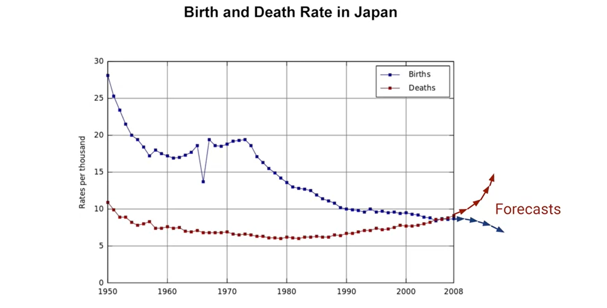

2. Projection back on to the time, this proces is call **Imputation**

3. How is your data base on others data

4. Time Series can be use to detected anormaly: for exapmple on **web site log** we can to see what is the problem.

1. Other option is to analyze **time series** to spot of find a pattern what generate the serie itself.

## Fixed Partitioning

## Roll-Forward Partitioning

## Metrics

## Naive Forecast MAE

## Moving Average

## Differencing

## Moving Average On Differenced Time Series

## Restoring The Trend And Seasonality

## Smooting Both Past And Present Values

## Preparing features and labels

## Window Method

## Drop_remainder Parameter

## Numpy Method

## Split the data into features and label

## Shuffle Method

## Batch Method

## Feeding windowed dataset into neural network

## Single layer neural network

## Split Data

## Simple Linear Regression

## Compile The Model

## Weight of Model

## Predict

## Plot A forecast

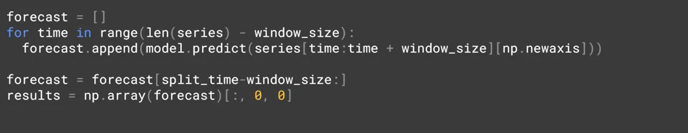

## Measure MSE

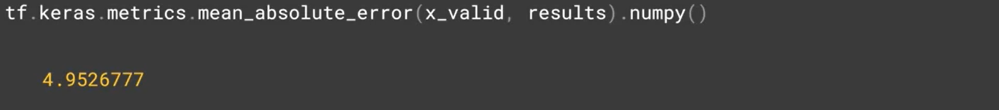

## Deep neural network training, tuning and prediction

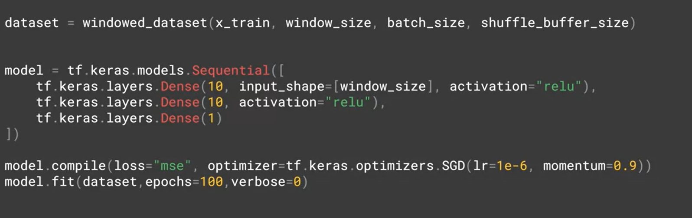

## MSE

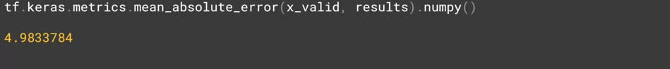

## Callbacks

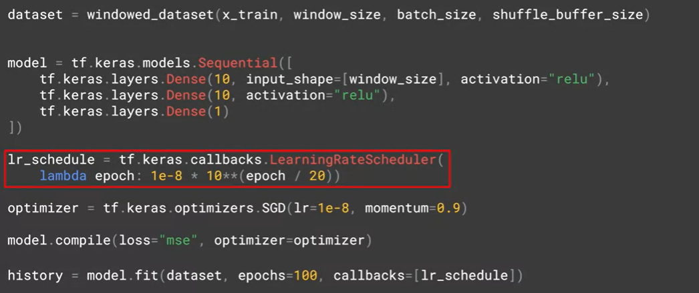

## Plot loss

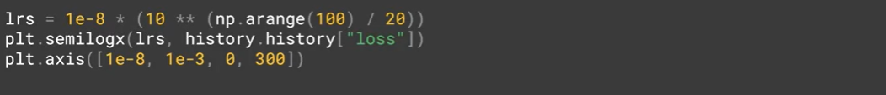

## Recurrent Layer

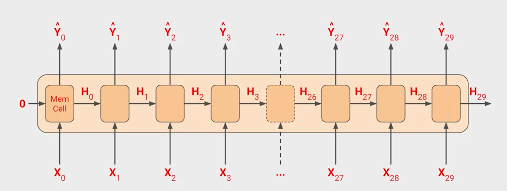

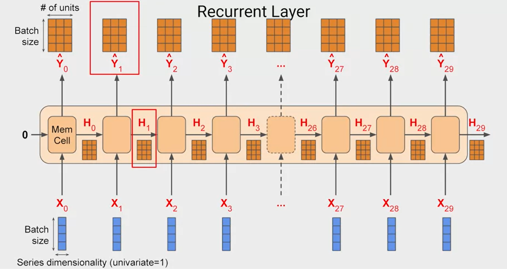

## Sequence to vector

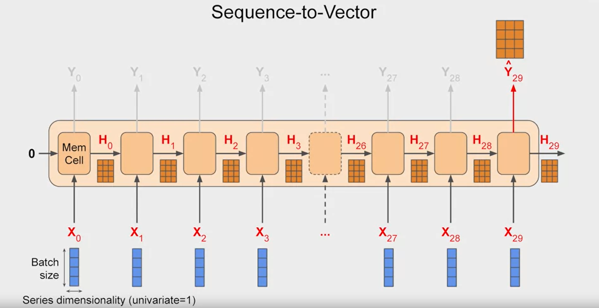

## In Practise

## Two Layers

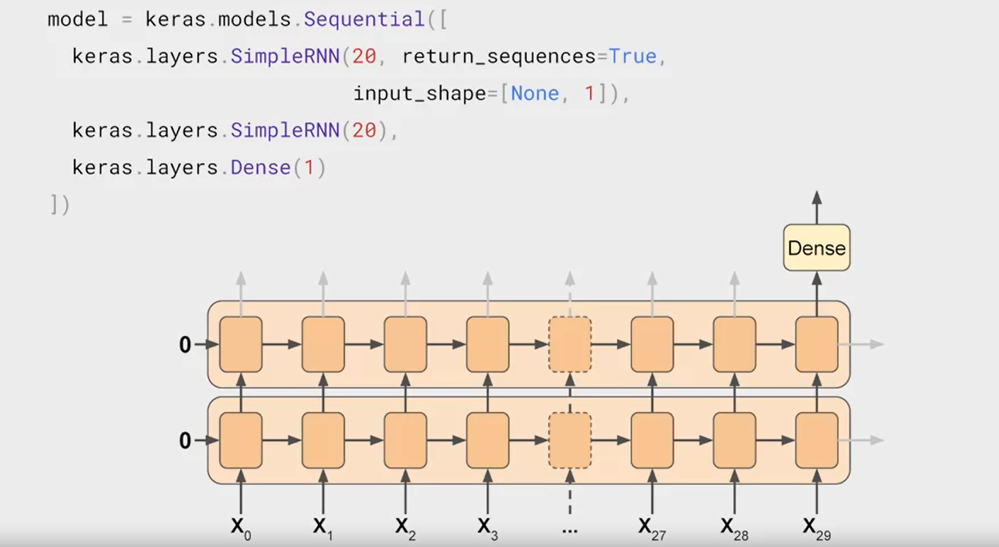

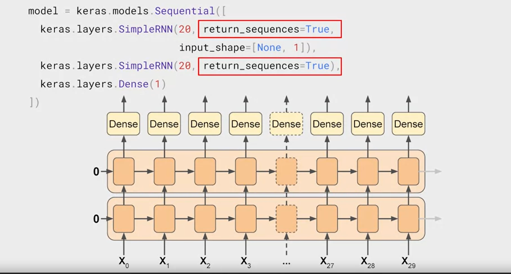

## Lambda Layers

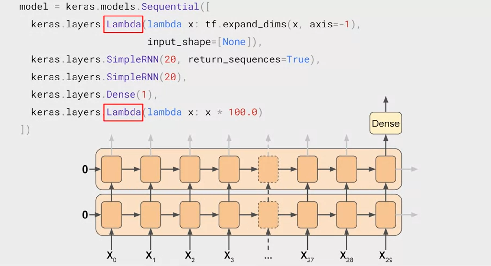

## Full RNN Code

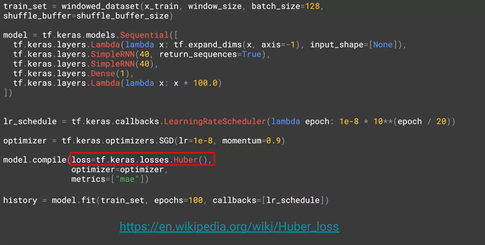

## Useful Link

* [https://en.wikipedia.org/wiki/Huber_loss](https://en.wikipedia.org/wiki/Huber_loss)

## LSTM

## Sell State

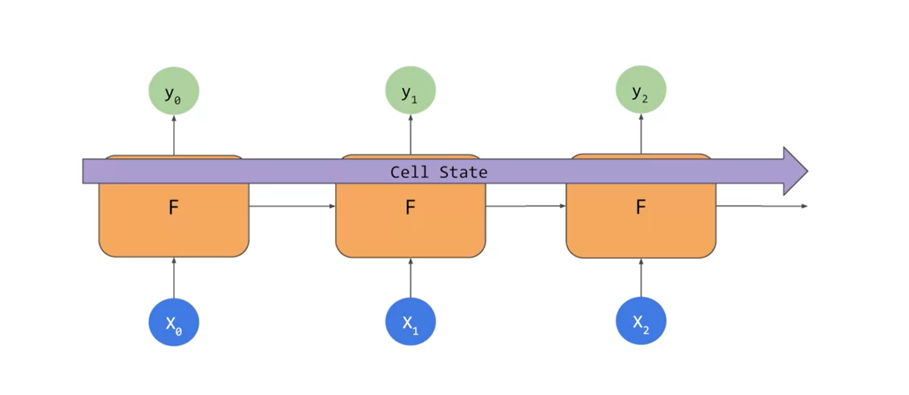

## Bi Directional Cell State

## Example of code LSTM

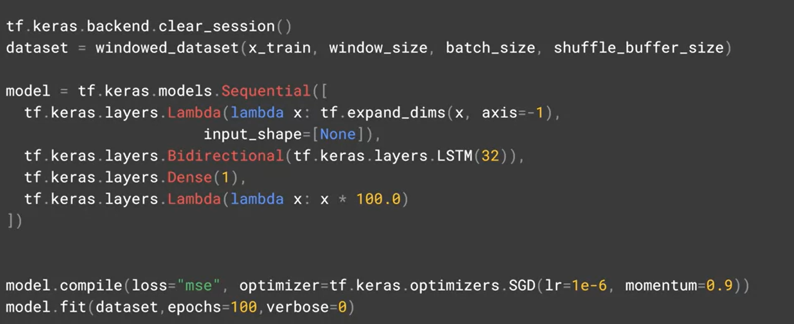

## Convolution

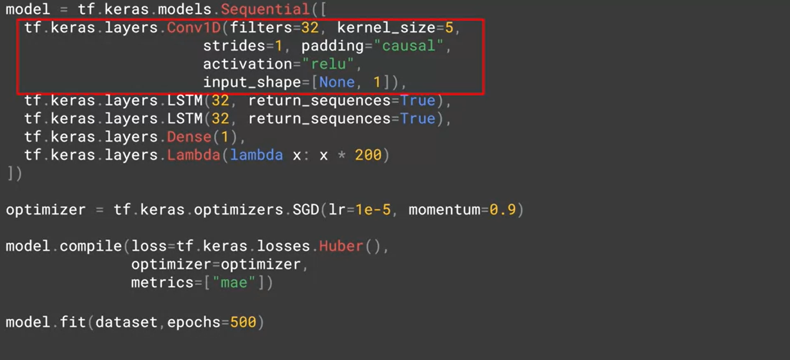

## Set Windows

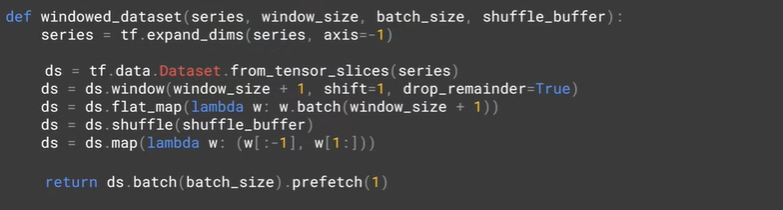

## Bi-directional LSTM

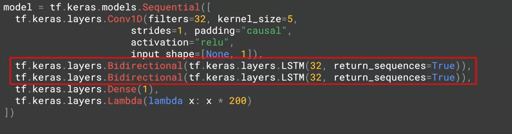

## More About Bi-direction LSTM

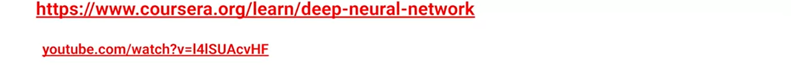

## More About Optimization Algorithm

* [https://www.youtube.com/watch?v=4qJaSmvhxi8](https://www.youtube.com/watch?v=4qJaSmvhxi8)

----------------------------------------

## Real World Data

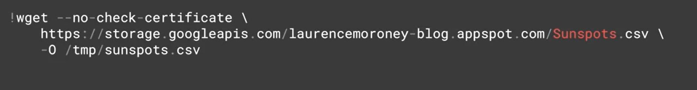

## How To Read Data

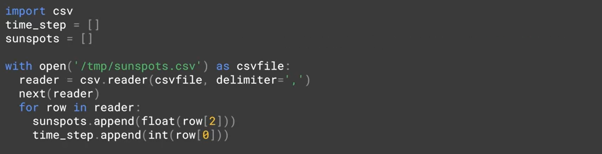

## Convert List To Series

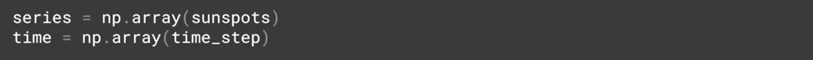

## Split Data

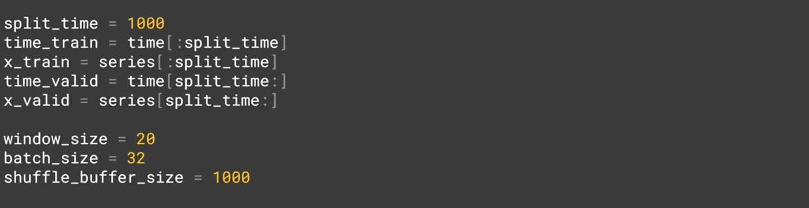

## Window Dataset

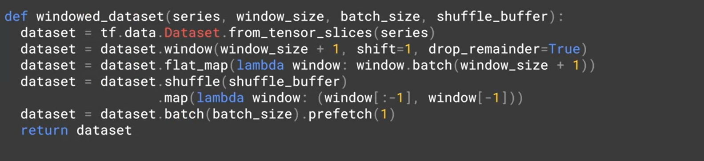

## Simple DNN

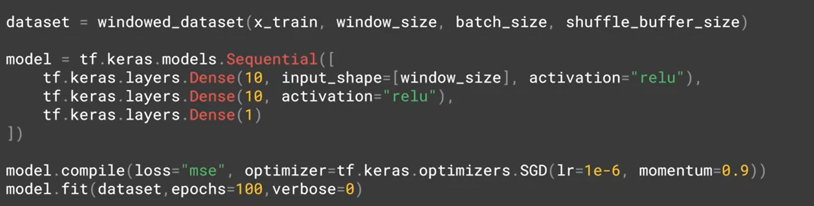

## Prediction

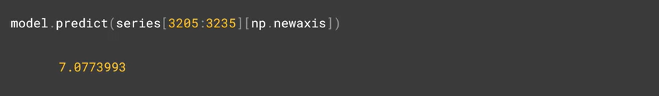

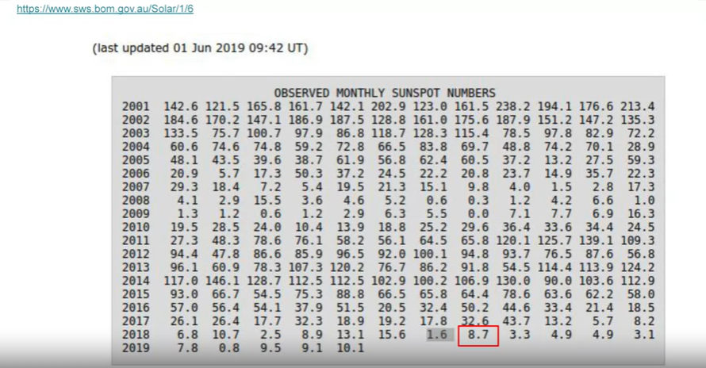